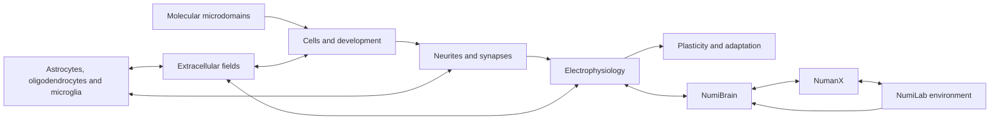

# NumiTissue

**Apple-native, multiscale simulation of developing neural tissue**

> Can the electrical, chemical, cellular, developmental, and behavioral dynamics of nervous tissue be represented in one executable system?

NumiTissue is a Swift and Metal research simulator built around that question. It is designed to model selected neural tissue across several interacting scales: molecular signaling, cells, neurite growth, membrane electrophysiology, synapses, plasticity, glia, extracellular chemistry, stimulation, and recording.

NumiTissue is also a component of the wider Numi suite. It connects detailed tissue dynamics to **NumiBrain** nervous-system computation, **NumanX** body and tissue physics, and the **NumiLab** experimental environment.

> [!IMPORTANT]
> NumiTissue is active research software. It is not a clinical device, is not validated for treatment decisions, and does not claim to reproduce a complete human brain. APIs, schemas, and numerical behavior may change while validation is in progress.

## The vision

Neural function emerges from processes that operate at different scales and different speeds. Ion channels change within fractions of a millisecond. Synapses adapt over seconds to days. Cells migrate, differentiate, grow processes, form connections, become injured, recover, or die. Those processes are also affected by body mechanics, metabolism, sensory experience, and behavior.

Most simulation systems isolate one part of this problem. NumiTissue is being built to make the interactions explicit and executable.



The long-term objective is a reproducible causal path from a molecular or cellular change to its consequences in tissue, circuits, body function, learning, and behavior.

## What NumiTissue represents

| Layer | Representation |
|---|---|
| Membrane electrophysiology | Morphological compartments, ion channels, axial currents, synaptic conductance, spike detection, and event delivery |
| Synapses and learning | Short-term dynamics, eligibility traces, neuromodulated plasticity, homeostasis, structural stabilization, pruning, and consolidation |
| Tissue development | Cell state, lineage, division, differentiation, migration, neurite extension, branching, retraction, and synaptogenesis |
| Glia and metabolism | Astrocytic support, extracellular regulation, oligodendrocyte and myelin state, microglial response, energy use, stress, and injury |
| Extracellular space | Tiled reaction-diffusion fields for ions, transmitters, metabolites, trophic signals, guidance signals, and damage signals |
| Molecular detail | Selectively allocated reaction networks for synapses, growth cones, nuclei, receptor pathways, and injured regions |
| Biological computing | Virtual multielectrode arrays, charge-balanced stimulation, recording, spike and field readouts, closed-loop protocols, and digital-twin assimilation |

NumiTissue does not apply maximum detail everywhere. It allocates detail where the modeled question requires it.

## Execution model

NumiTissue is designed around several constraints that are central to large biological simulations.

### Logical tissue tiles

Space is partitioned into bounded logical tissue tiles. A tile owns local cells, morphology, compartments, synapses, molecular domains, field voxels, event queues, and neighbor halos. Logical tiles are scheduled dynamically onto Apple GPU threadgroups and SIMD groups; they are not assumptions about undocumented physical GPU structure.

### Multiple biological clocks

Fast electrical processes and slow developmental processes do not advance at the same rate.

- The base fast-time quantum is **25 microseconds**.
- Tissue, brain, and body systems meet at a **5 millisecond transaction boundary**.
- Field, glial, metabolic, growth, differentiation, and structural processes run at their own explicit cadences.
- Developmental experiments can use short electrophysiology probe epochs rather than stepping every simulated day at electrical resolution.

### Adaptive fidelity

Every region can move between five representation levels:

| Level | Meaning |
|---|---|
| F0 | Field contribution only |
| F1 | Cell agent without detailed electrical state |
| F2 | Reduced active neuron |
| F3 | Morphologically detailed neuron |
| F4 | Detailed neuron with selected molecular microdomains |

Promotion is driven by activity, uncertainty, stimulation, injury, growth, behavioral relevance, and explicit user priority. Demotion uses hysteresis and conservation checks. State projection tracks quantities such as membrane charge, ion summaries, synaptic state, firing statistics, molecular totals, morphology, developmental age, and metabolic energy.

### Transactional simulation

Each coupled step is prepared in shadow state, checked, and then committed or rejected. This provides a defined boundary for:

- numerical validation;
- biological bounds;
- queue and capacity checks;
- reversible interventions;
- deterministic rollback;
- synchronization with NumiBrain and NumanX.

### Apple Silicon first

The production architecture is designed for Apple Silicon rather than translated from a CUDA-first runtime.

- Swift 6 strict concurrency on the host.
- Metal compute for production kernels.
- Unified-memory-aware buffer arenas.
- GPU-resident state during simulation epochs.
- Indirect work generation and active-region scheduling.
- SIMD-group execution for compartment, event, field, and reaction workloads.
- FP32 authoritative state with constrained lower-precision use where scientifically acceptable.
- A deterministic CPU reference backend for comparison and diagnosis.

## NumiTissue within the Numi suite

| System | Responsibility |
|---|---|
| **NumiTissue** | Cells, neural tissue, electrophysiology, molecular signaling, development, plasticity, glia, injury, and biological interfaces |
| **NumiBrain** | Perception, memory, motivation, planning, regional computation, motor selection, autonomic control, and embodied learning |
| **NumanX** | Rigid, articulated, deformable, fluid, contact, transport, injury, and body mechanics |
| **NumiLab** | Environments, experiments, organisms, sensors, tasks, observation, and reproducible execution |

Together, these systems are intended to support questions that currently require separate models and manual coupling:

- How does a molecular intervention alter cellular state and network activity?
- How does a network change alter movement, autonomic regulation, or learning?
- How does physical injury propagate from tissue strain to axonal damage and behavior?
- How does sensory experience change developing neural tissue?
- Can a stimulation protocol optimized in virtual tissue transfer to a living neuronal culture?
- Can a nervous system develop useful behavior through closed-loop interaction with a body and environment?

## What exists today

The repository contains an active implementation across the following areas:

- Core state, identifiers, timing, deterministic random streams, configuration, and GPU ABI definitions.
- Neural, glial, metabolic, extracellular, developmental, synaptic, plasticity, and molecular model structures.
- Model compilation and packed runtime representations.
- A deterministic CPU reference backend.
- A Metal backend with production scheduling, state management, kernels, and shader resources.
- Reversible transaction overlays for interventions, pharmacology, and pathology effects.
- Adaptive-fidelity planning and runtime migration infrastructure.
- Checkpoints, canonical serialization, cryptographic manifests, provenance, campaign sharding, journals, and resume state.
- Scientific observation paths, reductions, bounded raw capture, JSON Lines, and CSV output.
- SWC, SONATA, NeuroML/LEMS, SBML, portable expressions, and a restricted NMODL compilation path.
- Virtual-CNS screening, organoid-fitting, wetware-protocol, and sequential digital-twin workflow models.
- NumiBrain, NumanX, multielectrode-array, motor, autonomic, metabolism, and injury coupling contracts.
- A command-line interface and deterministic runnable workflow generators.

The implementation is substantial, but scientific calibration, end-to-end validation, hardware profiling, and some deep integration paths remain ongoing.

## Getting started

### Requirements

The primary development target is an Apple Silicon Mac with:

- macOS 15 or later;
- Xcode with Swift 6 support;
- a Metal-capable Apple GPU.

The package declares macOS 15, iOS 18, and visionOS 2 platform targets. The primary manifest uses Swift tools 6.2, with a Swift 6.0 compatibility manifest included in the repository.

### Clone and inspect

```bash
git clone https://github.com/Numi2/numitissue.git
cd numitissue

swift build
swift run numitissue help
```

### Generate the runnable workflow set

```bash
swift run numitissue-examples all .build/examples
```

This creates deterministic inputs for three workflow families:

- a replicated neural-tissue intervention screen;
- an organoid-fitting campaign;
- a safety-filtered wetware stimulation search.

See [`Examples/README.md`](Examples/README.md) for the generated files and exact commands.

### Selected CLI commands

```bash
# Inspect a checkpoint
swift run numitissue checkpoint inspect state.ntissue

# Compile a restricted NMODL mechanism
swift run numitissue nmodl compile mechanism.mod mechanism.json

# Validate and compile an experiment campaign
swift run numitissue validate-experiment experiment.json
swift run numitissue campaign compile experiment.json campaign-output --shards 4

# Compile a screening study
swift run numitissue screening compile study.json screening-output --shards 4

# Compile an organoid-fitting study
swift run numitissue organoid compile study.json fitting-output --shards 4

# Plan and validate a wetware protocol population
swift run numitissue wetware plan wetware-study.json initial-plan.json
swift run numitissue wetware validate protocol.json safety-envelope.json safety-report.json
```

CLI data output is machine-readable JSON unless the command is help or version.

## Using the Swift package

Add the repository as a Swift Package Manager dependency and depend on the `NumiTissue` product.

```swift
.package(
    url: "https://github.com/Numi2/numitissue.git",
    branch: "main"
)
```

```swift
import NumiTissue
```

The top-level module exposes experiment construction, campaign compilation, observed sessions, workflow plans, reference execution, Metal execution, adaptive fidelity, suite integration, screening, calibration, and wetware protocol types. Lower-level products are available for applications that require explicit control over models, I/O, runtime, or backend selection.

## Repository structure

| Path | Purpose |
|---|---|
| `Sources/NumiTissue` | High-level public API, experiments, campaigns, sessions, and workflow plans |
| `Sources/NumiTissueCore` | Fundamental state, biology, runtime contracts, Metal ABI, fidelity, events, and production state |
| `Sources/NumiTissueModels` | Scientific model definitions, topology, parameters, compilation, and packed executable models |
| `Sources/NumiTissueRuntime` | Transactions, overlays, scheduling, validation, observations, interventions, pathology, and adaptive execution |
| `Sources/NumiTissueReference` | Deterministic CPU reference solvers and scientific comparison paths |
| `Sources/NumiTissueMetal` | Apple GPU backend, buffer management, execution graph, and Metal shaders |
| `Sources/NumiTissueIO` | Importers, project bundles, checkpoints, canonical encoding, provenance, and campaign artifacts |
| `Sources/NumiTissueData` | Data-oriented scientific utilities and model-facing datasets |
| `Sources/NumiTissueIntegration` | NumiBrain, NumanX, MEA, wetware, digital-twin, and protocol integration |
| `Sources/NumiTissueCLI` | Deterministic command-line interface |
| `Examples` | Runnable study and campaign generators |

## Scientific and engineering principles

### Make scale boundaries explicit

A multiscale model should state what is represented directly, what is summarized, and when information moves between scales. NumiTissue treats fidelity changes and scale coupling as first-class runtime operations.

### Preserve scientifically meaningful quantities

Promotion, demotion, intervention, rollback, and checkpoint operations should conserve or report changes in meaningful state rather than silently replacing it.

### Separate authoritative state from acceleration

Performance techniques must not quietly redefine the model. Authoritative state, lower-precision acceleration, compressed connectivity, and learned approximations have separate contracts.

### Require reproducibility

Experiments carry deterministic identifiers, seeds, canonical encodings, cryptographic digests, device metadata, backend settings, provenance, and explicit validation outcomes.

### Keep a reference path

The CPU reference backend exists to make production Metal behavior comparable, diagnosable, and testable. A fast result is not sufficient when its numerical origin cannot be inspected.

### Validate before making biological claims

NumiTissue is intended to be compared against established electrophysiology, reaction-diffusion, tissue-development, and experimental datasets. Current implementation breadth must not be confused with completed biological validation.

## Research directions

The architecture is being developed toward four increasingly connected capabilities.

### Validated neural microtissue

A bounded tissue volume whose electrical, chemical, developmental, glial, metabolic, and injury behavior can be compared against reference simulators and laboratory measurements.

### Digital twins of living neural cultures

Sequential assimilation of multielectrode-array, calcium-imaging, morphology, and molecular measurements into an ensemble of virtual tissues, with uncertainty retained rather than hidden.

### Simulation-to-wetware experiments

Closed-loop stimulation and recording protocols that can be optimized under explicit safety constraints in NumiTissue and then executed against supported neuronal-culture or organoid systems.

### Developing embodied nervous systems

Neural tissue and regional brain systems coupled to a physically simulated body and environment, allowing development, sensation, movement, plasticity, memory, injury, recovery, and behavior to influence one another over time.

## Non-goals

NumiTissue is not intended to:

- claim a complete neuron-by-neuron human brain reproduction;
- replace laboratory evidence with unvalidated simulation;
- provide clinical diagnosis or treatment selection;
- treat every molecular species or synapse at maximum resolution;
- hide uncertainty behind a single predicted outcome;
- make GPU throughput more important than model meaning and reproducibility.

## Contributing

The project is evolving quickly. For substantial changes, open an issue describing the biological scope, numerical assumptions, affected invariants, data layout, and expected CPU/Metal behavior before restructuring core interfaces.

Useful contributions include reference cases, import fixtures, scientifically grounded parameter sets, conservation checks, CPU-versus-Metal comparisons, profiling data from Apple Silicon, and clearly bounded biological models.

---

NumiTissue is built for experiments in which changes can be followed across scale: from molecules and cells, through tissue and circuits, into body function and behavior. The purpose is not to declare that biology has been solved. The purpose is to make increasingly complete biological hypotheses executable, inspectable, and reproducible.